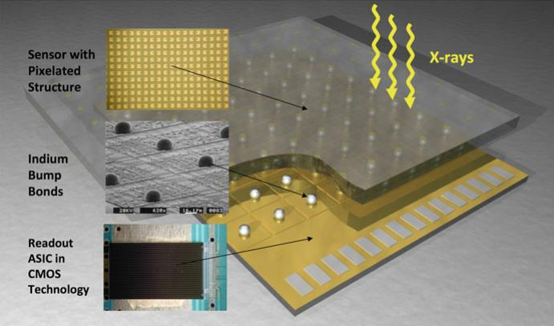
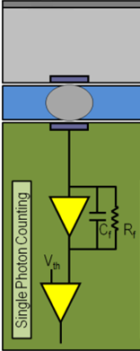
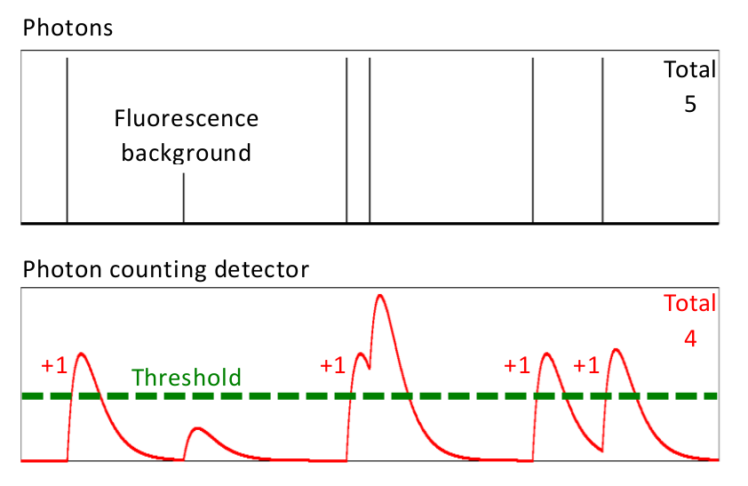
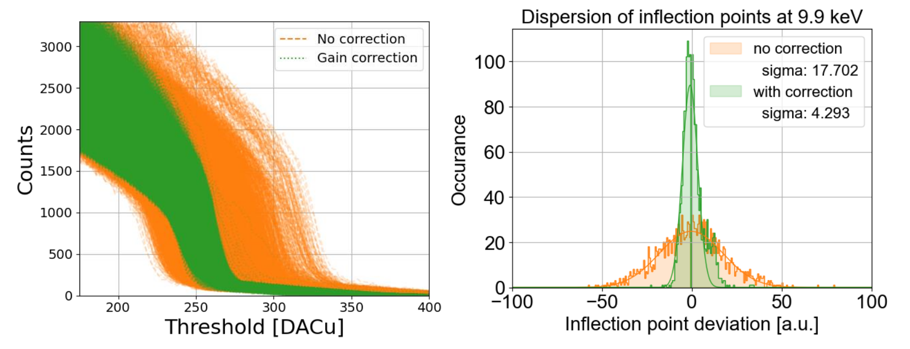

# ML for Hybrid Pixel Detector Calibration
*Authors: François Caud (Dataia, Université Paris-Saclay), Marie Andrä, Martin Chauvin, Arkadiusz Dawiec (SOLEIL Synchrotron, Saint Aubin, FRANCE)*

Research conducted at synchrotron light sources, such as crystallography, X-ray diffraction and
imaging experiments, relies on high-performance detectors with good energy resolution and
signal quality. Single-photon counting hybrid pixel detectors are the preferred choice fulfilling
this need in the tender to hard X-ray regime [1], [2].
A hybrid pixel detector consists of two key components that are bump-bonded together (see
Figure 1): the sensor and the readout chip, typically with tens of thousands up to millions of
pixels. The silicon sensor is the detection layer where incoming photons (X-rays) interact with
the silicon, generating electron-hole pairs. The resulting electrical charge is collected by an array
of electrodes that corresponds to the pixel pattern. The readout chip is a complex, pixelated
ASIC (Application-Specific Integrated Circuit). Each pixel contains an independent electronic
circuit comprising thousands of transistors, which is designed to process the collected charge
signal. “A pixel in a typical single-photon counting detector consists of a charge-sensitive
preamplifier, shaper, comparator, and counter” [2].

  
  

  

    <strong>Figure 1:</strong> a) Drawing of a typical hybrid pixel detector. The sensor absorbs the X-rays and transmits the created
electrical signal through the bump bonds to the readout ASIC [1]. b) Simplified schema of a hybrid pixel detector with
the sensor on top (grey), connected to the readout ASIC (green) via bump bonds (grey circles on blue background).
[Figure from R. Dinapoli, Paul-Scherrer-Institute, CH]
   

In the context of photon-counting detectors, the primary operational mechanism is charge
discrimination. When a photon hits the sensor and generates a charge signal, the circuit in the
corresponding pixel determines if the collected charge exceeds a global electronic threshold. If
so, the pixel increments its internal counter by one. Figure 2 illustrates this principle. Ideally, the
threshold applied by every pixel would be identical. However, due to inherent mismatches in the
semiconductor fabrication process, the thousands of transistors within each pixel circuit do not
behave exactly alike. This results in variations in the effective pixel threshold or preamplifier
gain. This “threshold dispersion, i.e., the accuracy of tuning the threshold at the same energy
level for all the channels” [2], leads to artifacts in the final image and thus reduced data quality.
To counteract these fabrication effects, each pixel is equipped with correction parameters (e.g.,
trim bits) that allow to fine-tune the effective threshold or gain. Therefore, the detector's overall
performance depends on the precise and careful tuning of these numerous parameters across
all pixels.

  

   

    <strong>Figure 2:</strong> Principle of a photon counting detector: For each arriving photon, the readout pixel evaluates whether the signal surpasses a set threshold and if so, increases the counter. (Figure adapted from [2])
   

The standard technique for robust gain correction and energy calibration is the threshold scan,
resulting in so-called S-curves. In a S-curve scan, the global threshold is scanned across a wide
range while the detector is exposed to a monochromatic X-ray beam of known energy. Plotting
the resulting counts against the applied threshold yields an S-shaped curve (a cumulative
distribution function), as shown in Figure 3a. The inflection point of this S-curve corresponds to
the threshold that matches the energy of the incident beam. By finding this inflection point for
every single pixel, the detector can be accurately calibrated to the beam energy. Figure 3 shows
the threshold scans and the resulting distribution of inflection points for an uncorrected (orange)
and a corrected (green) detector. The process involves fitting S-curves to the data (one per pixel,
energy, and gain bit) using an empirical model. This procedure is time-consuming, often
involving multiple scans and generating large quantities of data. Furthermore, empirical fits are
prone to failure, necessitating manual intervention and contributing to lengthy calibration times.

  

   

    <strong>Figure 3:</strong> a) Comparison of uncorrected (orange) and corrected (green) threshold scans of many pixels of a photon-
counting detector. This example shows how the pixel-by-pixel correction reduces the dispersion of the inflection
points. b) shows the deviation of the pixel inflection points from the mean value.
   

Given the scale of the parameter space and the duration of traditional fitting routines, there is
significant interest in investigating Machine Learning models to expedite the correction and
calibration process of hybrid pixel detectors. The immediate goal of this challenge is to develop
an ML model capable of quickly and reliably identifying the inflection point in the S-curve data
for each pixel, regardless of beam energy or the presence of noise. Replacing error-prone, time-consuming fits with an ML-based prediction could drastically reduce the time required for
detector correction and calibration, leading to faster calibration procedures and improved data
quality. In the long term, ML could potentially be used to automate the entire correction and
calibration process, making these complex detectors more accessible and efficient for cutting-
edge synchrotron research.

[1] C. Brönnimann and P. Trüb, “Hybrid pixel photon counting X-ray detectors for synchrotron
radiation,” Synchrotron Light Sources Free-Electron Lasers Accel. Phys. Instrum. Sci. Appl.,
pp. 1191–1223, Jan. 2020, doi: 10.1007/978-3-030-23201-6_36/FIGURES/16.
[2] E. Fröjdh, A. Bergamaschi, and B. Schmitt, “Single-photon counting detectors for diffraction-
limited light sources,” Front. Phys., vol. 12, p. 1304896, 2024, doi:
10.3389/FPHY.2024.1304896.
